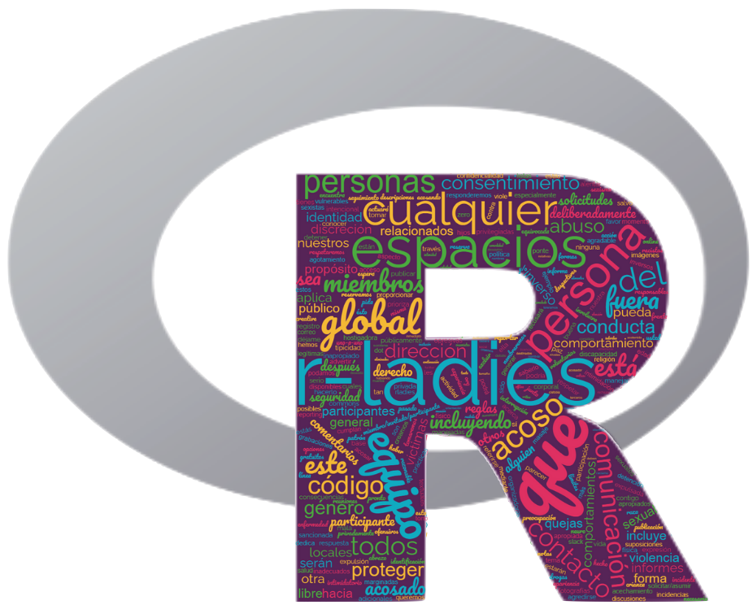

## Código de Conduta

As RLadies tem como objetivo proporcionar uma experiência livre de assédio para todos. O nosso código de conduta aplica-se a todos os espaços RLadies, incluindo: meetups, Twitter, Slack, Telegram, listas de discussão, tanto online como offline. Para mais informações, acesse o nosso código de conduta em [Português](https://guide.rladies.org/about/coc/#portuguese).

## Código de Conducta 

RLadies se dedica a proporcionar una experiencia libre de acoso para todos. Nuestro código de conducta aplica en todos los espacios de participación de R-Ladies, incluyendo reuniones, Twitter, Slack, Telegram, listas de correo, tanto online como offline. Para más información, acceda a nuestro código de conducta en [Español](https://guide.rladies.org/about/coc/#spanish).

## Code of Conduct

RLadies is dedicated to providing a harassment-free experience for everyone. Our code of conduct applies to all R-Ladies spaces, including meetups, Twitter, Slack, Telegram, mailing lists, both online and offline. For more information, access our code of conduct in [English](https://guide.rladies.org/about/coc/#english).

