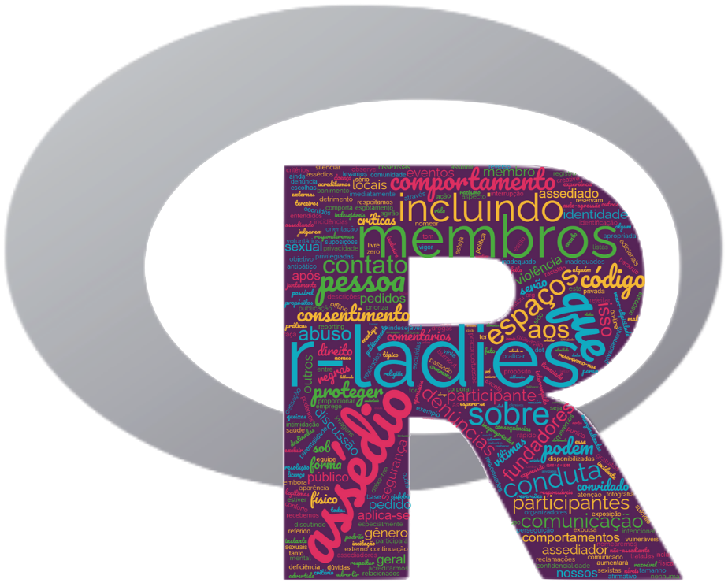
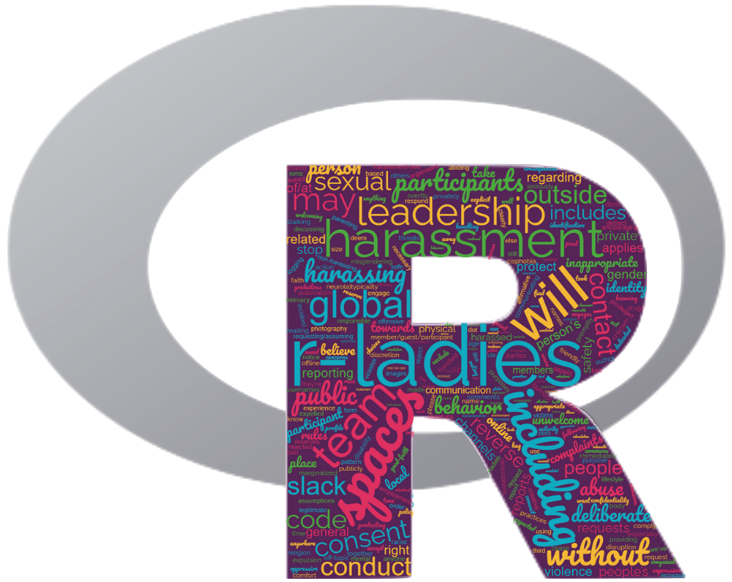

## Código de Conduta

As RLadies tem como objetivo proporcionar uma experiência livre de assédio para todos. O nosso código de conduta aplica-se a todos os espaços RLadies, incluindo: meetups, Twitter, Slack, Telegram, listas de discussão, tanto online como offline. Acesse o nosso código de conduta na página das [RLadies Global](https://guide.rladies.org/about/coc/#portuguese)

## Código de Conducta 

RLadies se dedica a proporcionar una experiencia libre de acoso para todos. Desde R-Ladies no toleramos el acoso de los participantes en ninguna de las formas posibles. Este código de conducta aplica en todos los espacios de participación de R-Ladies, incluyendo reuniones, Twitter, Slack, Telegram, listas de correo, tanto online como offline. Acceda a nuestro código de conducta en el [RLadies Global](https://guide.rladies.org/about/coc/#spanish)

## Code of Conduct

R-Ladies is dedicated to providing a harassment-free experience for everyone. We do not tolerate harassment of participants in any form. This code of conduct applies to all R-Ladies spaces, including meetups, Twitter, Slack, Telegram, mailing lists, both online and offline. Access our code of conduct on the [RLadies Global(https://guide.rladies.org/about/coc/#english)

